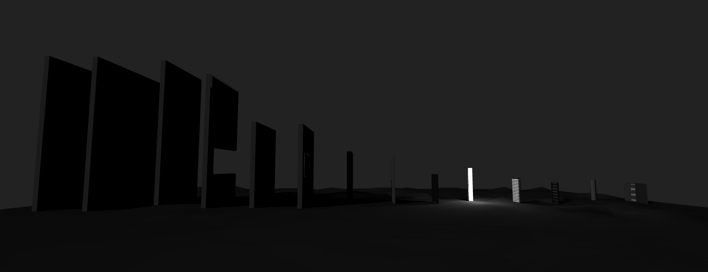

# *v r 1*

# Download *v r 1* for [Mac OS X](https://github.com/pippinbarr/v-r-1/releases/tag/mac) or [Windows](https://github.com/pippinbarr/v-r-1/releases/tag/windows), or [Play Online](https://www.pippinbarr.com/v-r-1/webgl/) (desktop only)

## Description
*A room! A trunk! A tube! A bed! A radiator! A light! A landscape! A darkness! A separation! A floating in air! A doubling! An intersection! And more! And more!*

_v r 1_ was made in [Unity](http://unity3d.com/) (using [First Person Drifter](http://torahhorse.com/first-person-drifter-controller-for-unity3d) by [Ben Esposito](http://torahhorse.com/) with a couple of small edits) and [SketchUp](http://www.sketchup.com/). Sound effects were made in [Audacity](http://www.audacityteam.org/) and [bfxr](http://www.bfxr.net/). _v r 1_ is based on the work of [Gregor Schneider](http://www.gregor-schneider.de/), specifically the room &#8220;u r 1&#8221; in his &#8220;Totes Haus u r&#8221;.

## Documentation
* Read the [Process Documentation](../process)
* Look at the [Code Repository](https://github.com/pippinbarr/v-r-1) for source code etc.

## Press
Read the [Press Kit](../press) for press information

* [Kill Screen](https://killscreen.com/articles/time-confront-uncanny-potential-virtual-architecture/)
* [Warp Door](http://warpdoor.com/2016/05/23/v-r-1-pippin-barr/).

## License
*v r 1* is licensed under a [Creative Commons Attribution-NonCommercial 3.0 Unported License](http://creativecommons.org/licenses/by-nc/3.0/).
