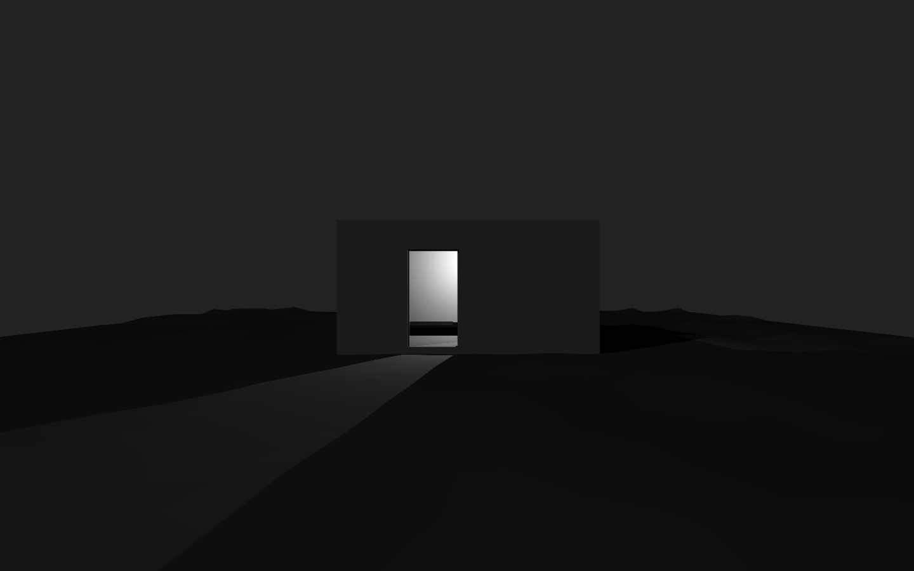
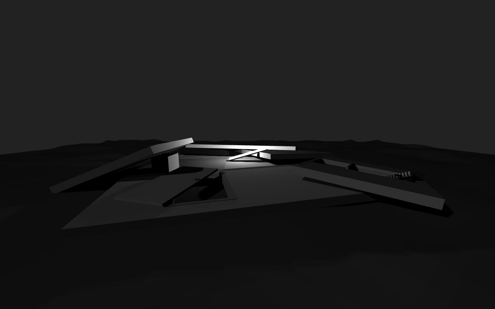

# *v r 1*

## Information
* Released: 19 May 2016
* Website: http://www.pippinbarr.com/
* Platforms: Mac, Windows, Browser
* Link: https://www.pippinbarr.com/v-r-1/info
* Price: Free.

## Description
A room. A trunk. A tube. A bed. A radiator. A light. A landscape. A darkness.
A separation. A floating in air. A doubling. An intersection. And more. And more.

## History
v r 1 is a project based on the artist Gregor Schneider's iconic work "Totes
Haus u r", and specifically the room inside it known as "u r 1". Schneider's
art has involved the almost endless renovation, re-renovation and re-invention
of the interior of a house in Mönchengladbach-Rheydt in Germany. The house
contains rooms that rotates, rooms that are completely insulated, walls behind
walls, and much more. Schneider has also recreated/doubled the entire house for
the Venice Biennale, and has created doubles of various rooms/houses at other times.

v r 1 is an exploration of related ideas in virtual space with virtual architecture.

In particular, I was most interested in seeing how creating doubled spaces differs
in a virtual setting – notably the idea that doubling is trivial in this context,
amounting to nothing more complex or laborious than "cut and paste". With that in
mind I wanted to experiment in different ways with the configuration and setting
of the room that would acknowledge and work with its virtual nature, trying to
evoke a related uncanny and creepy effect in the very different medium. A success?
Who knows.

## Features
* A room of one's own!
* A room of one's own upside down!
* A room of one's own in pieces!
* A room of one's own in darkness!
* A room of one's own in the air!

## Images

## Trailer
[View the trailer on YouTube](https://youtube.com/watch?v=7L0AvDb2fFs)

## Links
* [Gregor Schneider's homepage](http://www.gregor-schneider.de/biography.htm#currently)
* [Gregor Schneider on Wikipedia](https://en.wikipedia.org/wiki/Gregor_Schneider)

## Credits
* Pippin Barr: Everything
