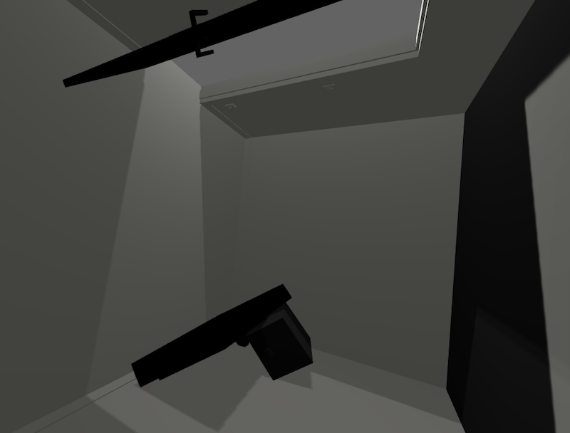

# Blog Posts

Here are public-facing blog posts I wrote while creating the game.

## New Project: Rooms (2016-04-18)

I'm starting a new thing, continuing on with Unity since we've developed a wary friendship over the course of _[Post-Apocalyptic Abramovic Method Game](http://www.pippinbarr.com/2016/04/15/post-apocalyptic-abramovic-method-game/)_. When I was making _[The Stolen Art Gallery](http://www.pippinbarr.com/2015/05/13/the-stolen-art-gallery/)_ I was also very interested in an artist called [Gregor Schneider](http://www.gregor-schneider.de/), and kept thinking about ways to incorporate some of his ideas into 3D spaces, but then I got distracted by another project and didn't come back to it. And I kind of hated using Unity. So there you go.

Anyway, I'm back to a project that vaguely involves some of Schneider's work. The idea is revolving around creating a single room that I then manipulate in different ways, based on how Unity works, how 3D works, how "games" work, etc. to give it a different feeling or flavour. This is somewhat in keeping with Schneider's idea of repeatedly creating rooms, walls, spaces, sometimes replicating them in different locations, and always somehow making them feel very uncanny indeed. (If you're not familiar with his work and you're interested in "space" at all, I really recommend it.) Of course, the reasons that Schneider's work is interest – such as the intense labour he performs to recreate a room – aren't applicable in the same ways in a 3D engine. After all, replicating a space in Unity is literally as simple as cut and paste, right? But then there are, I assume, other ways that working with a single room can be interesting. And that's what I aim to find out.

As such, I'm making the single room now, based on Schneider's iconic _u r 1_. This is proceeding at the usual nightmarishly slow pace as I continuously don't understand how to do anything in 3D, but I think it's moving forward rather than backward. Once the room is done, I can then make these variations (hopefully a little quicker). My current thought is to "release" these rooms in small sets, but keep it as a continuous project for exploring ideas around 3D space with a highly constrained base case.

That's what I'm doing. What are you doing? That's a rhetorical question. There is also no comments section enabled at the moment. So.

## Project progress: v r 1 (2016-05-18)

Oh yes, hello. Not dead yet. After bravely announcing I was working on a thing I was calling _Rooms_ and failed to write anything about the process whatsoever, and now I'm putting it out tomorrow, so that was something of a failure of documentation. It's now called _v r 1_ in clever tribute to both Gregor Schneider's work _AND MORE IMPORTANTLY THE HOT HOT NEW NEW TREND OF VIRTUAL REALITY IN VIDEOGAMES_. I'm on the train.

Anyway, the project went quite well in the end. I made the basic room modelled on Schneider's "u r 1" room. Later I had to remake parts of it because it was a disaster in WebGL. Impressively, the scene as a whole had something like 600,000 triangles in it (one possible measure of how "big" it is in terms of memory and processing and so on). I then realised that the bed and radiator were accounting for about, say, 450,000 triangles of that, because they had a couple of measly curves. And importantly a couple of measly curves probably done in the worst possible way in SketchUp. My continuing ineptness. So I just gave them cool-sexy retro flat edges and all was well in the world. Just another aesthetic win for the inept crowd.

After that the process was coming up with Unity-oriented ways to manipulate the room into different "levels" for the game, whether that was turning it upside down or breaking it into pieces (pictures above). The broken up versions were the most interesting for me in some ways because they felt closest to replicating the sense of "hidden labour" I get from Schneider's work (and from reading about his process, more specifically). To make the pile of pieces of the room I ended up effectively acting as the physics engine, placing each individual piece, rotating it, and so on in order to give the effect of it having collapsed. It's plausible I could have somehow asked the Unity physics engine to do this, but I couldn't learn how, and I'm willing to bet that the "proper" simulation would have looked aesthetically less pleasing than the artisanal physics I applied myself. That seems to me to get this project closest to a kind of "sculptural" form.

At any rate, you can see it tomorrow if you want. I've already moved on to The Next Big Thing.
